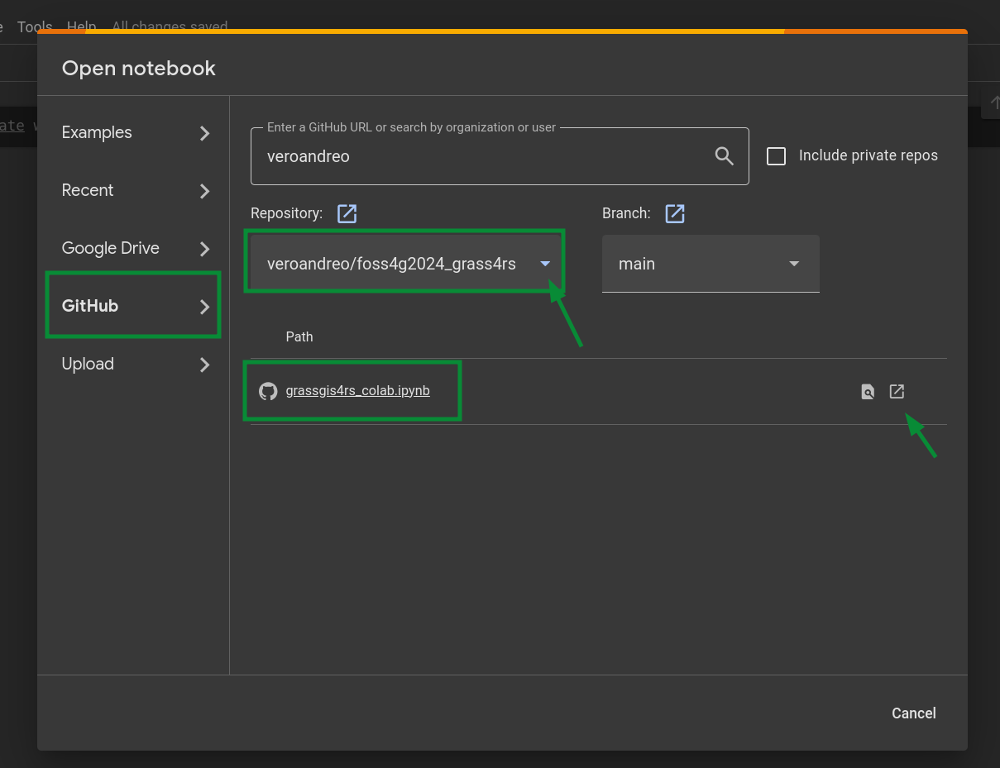

# [GRASS GIS for Earth Observation data processing with Jupyter notebooks](https://talks.osgeo.org/foss4g-2024-workshop/talk/ZVWCZC/)

This repo holds the Jupyter notebook that will be used for the **GRASS for Earth Observation**
workshop at FOSS4G 2024 in Belem, Brazil.

We will present and exemplify a subset of GRASS GIS toolsets for satellite imagery data 
processing and analysis in combination with other core modules and addons in a workflow 
going from data search and download to supervised classification of different scenes 
and visualization of results.

:exclamation: **The workshop will be run in [Google Colab](https://colab.research.google.com/), attendants do not need to install any software in their machines.**

To open the notebook in [Google Colab](https://colab.research.google.com/), just use the URL 
of this repository as shown below:



---

## Software requirements for running the notebook locally (try at home)

### GRASS GIS

We will use **GRASS GIS 8.4+**. It can be installed either through standalone
installers/binaries or through [OSGeo-Live](https://live.osgeo.org/en/index.html)
(a Linux-based virtual machine that includes all OSGeo software and packages).

##### MS Windows

There are two different options:
1. [OSGeo4W 64-bit](http://download.osgeo.org/osgeo4w/v2/osgeo4w-setup.exe)
2. [Standalone installer 64-bit](https://grass.osgeo.org/grass84/binary/mswindows/native/WinGRASS-8.4.0-1-Setup.exe)

For Windows users, **we strongly recommend installing GRASS GIS through the OSGeo4W package** (first option),
since it allows the installation of all OSGeo software.

##### Ubuntu Linux

Install GRASS GIS 8.4 from the "unstable" package repository:

```
sudo add-apt-repository ppa:ubuntugis/ubuntugis-unstable
sudo apt-get update
sudo apt-get install grass grass-gui grass-dev
```

##### Fedora, openSuSe Linux

For other Linux distributions including **Fedora** and **openSuSe**,
install GRASS GIS with the respective package manager.
See also [here](https://grass.osgeo.org/download/linux/#GRASS-GIS-current).

##### Mac OS

Have a look at: http://grassmac.wikidot.com/downloads

## Other required Python packages

Please install other required Python packages with the following: 

```
python -m pip install eodag[usgs] notebook folium ipyleaflet scikit-learn pandas numpy seaborn matplotlib
```

## Data

Please download the following files in advance:

- North Carolina (NC) sample data: https://grass.osgeo.org/sampledata/north_carolina/nc_spm_08_grass7.zip
    -  [List of available data](https://www.grassbook.org/wp-content/uploads/grasslocations/nc_spm_08_contents.html) in the North Carolina sample dataset.
- Sentinel-2 scenes: https://data.neteler.org/foss4g2022/sentinel.zip
- NC NLCD 2019 map in GRASS GIS format: https://data.neteler.org/foss4g2022/nc_nlcd2019.pack

## Registration at Copernicus Data Space Ecosystem

We'll use Sentinel-2 data and hence users must be registered at the
[Copernicus Data Space Ecosystem](https://dataspace.copernicus.eu/).

Fill in the form [here](https://identity.dataspace.copernicus.eu/auth/realms/CDSE/protocol/openid-connect/auth?client_id=cdse-public&redirect_uri=https%3A%2F%2Fdataspace.copernicus.eu%2Fbrowser%2F&response_type=code&scope=openid)
and create a text file with two lines including `username` and `password`,
such as:
```
username
password
```

## Lecturer

- [Veronica Andreo](https://veroandreo.gitlab.io/) holds a PhD in Biology and an MSc in Remote Sensing and GIS Applications. She is a researcher for CONICET working at Gulich Institute, in the Argentinian Space Agency. Her main interests are remote sensing and GIS tools for disease ecology research and applications. She is part of the GRASS Dev Team, currently serving as PSC chair.
